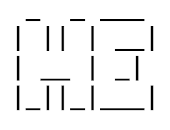

### primejade

All my dotfiles and project will appear in this repository.

just a regular TeXguy with a passion about open-source

I have some experiences in:

- Linux
- C
- C++
- Python
- Bash
- LaTeX
- Markdown
- GNU core utilities
- Suckless tools

I love the concept of libre soft/hardware

Also I am going to become a DevOps engineer, so I'm gonna learn

- [ ] Docker
- [ ] Ansible
- [ ] MySQL Database
- [ ] Kubernetes

Many things is our there that I also intrested in, including:

- Program/Scripting
    - [ ] Lua
    - [ ] Haskell
- Decenterlized technologies
    - [ ] SMTP/IMAP Protocls
    - [ ] XMPP Protocol
- Web server
    - [ ] Apache
    - [ ] Nginx
- Frameworks
    - [ ] Django
    - [ ] Qt

<!---
__Interested in__

- Code and Coffee
- Learning

__Contact:__

- mail: primejadevi@pm.me

__Todo List:__

- [x] push vim configurations
- [x] push suckless build
- [ ] push neovim workflow configurations
- [ ] push cheatsheets
- [ ] update dotfiles and add the new ones

- Social media
    - [ ] linkedin profile
    - [ ] stackoverflow

primejade/primejade is a ✨ special ✨ repository because its `README.md` (this file) appears on your GitHub profile.
You can click the Preview link to take a look at your changes.
--->
